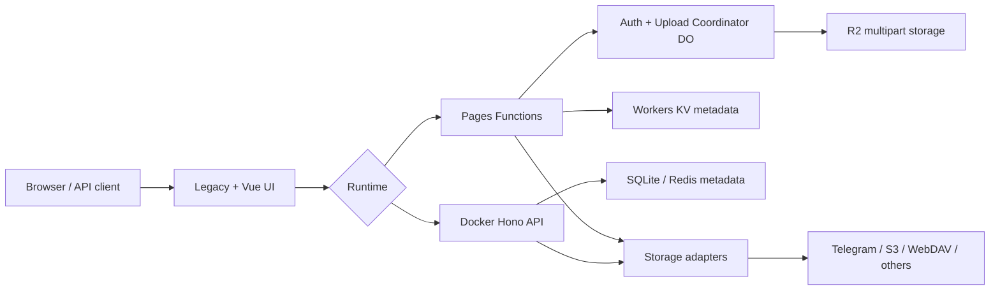

<div align="center">
  

# Seraph's Pictures

A private media workspace for Cloudflare and Docker with multiple storage backends, guest image hosting, file management, and secure sharing.

[中文](README.md) | **English**

[](LICENSE)


</div>

## Security warnings

> [!WARNING]
> Do not deploy the checked-in Wrangler configuration unchanged after forking. Replace project and Worker names, every KV ID, R2 bucket name, Durable Object `script_name`, WebAuthn domain/origin, and migration audience in both configuration files. Deploy the Coordinator before Pages.

> [!IMPORTANT]
> Production must keep authentication enabled and store secrets as Secrets. `AUTH_DISABLED=true` is local-only. Coordinator, KV, or encryption-key failures are explicit; the service does not degrade to legacy credentials or plaintext configuration.

## Features and interfaces

- Upload images, media, and documents with URL upload, chunked/multipart paths, and SSRF protection.
- Telegram, R2, S3, Discord, Hugging Face, WebDAV, and GitHub storage adapters.
- Password and Passkey/WebAuthn login, scoped API tokens, short links, and signed private shares.
- Folder tree, filtering, batch move/delete, rename, visibility controls, and previews.
- Isolated Telegram bot/channel, fixed quotas, and content authenticity checks for public guest image hosting.
- Stable Legacy UI: `/`, `/login.html`, `/admin.html`, `/gallery.html`, `/webdav.html`, `/storage-settings.html`.
- Vue UI: `/app/`, `/app/drive`, `/app/storage`, `/app/status`; both runtimes implement its Storage, Drive, and Share APIs.

| Upload | Gallery | Administration | Passkey |
| :---: | :---: | :---: | :---: |
|  |  |  |  |

## Architecture



Cloudflare coordinates authentication and R2 multipart state with Durable Objects and stores metadata in KV. Docker runs Hono with SQLite, an optional Redis settings store, and persistent volumes. The UI is shared; persistence and adapter implementations differ.

## Quick start

| Goal | Choose | Shortest path |
| --- | --- | --- |
| Global edge, serverless | Cloudflare Pages + Worker | Create KV/R2/DO, edit configs, deploy Worker then Pages |
| VPS, NAS, local private hosting | Docker Compose | Generate `.env`, replace secrets, build and start |

```bash
npm ci
npm run frontend:build
npm run docker:init-env
docker compose up -d --build
npm run docker:doctor
```

Development and the Docker backend require Node.js 22+. Never commit `.env`, real tokens, passwords, or encryption keys.

## Cloudflare deployment

1. Create a Pages project, KV namespace, R2 bucket, and a Worker that hosts both Durable Objects.
2. Replace every repository-specific value in `wrangler.jsonc` and `workers/coordinator/wrangler.jsonc`:

| Placeholder | Replace in |
| --- | --- |
| `<PAGES_PROJECT>` | Pages `name` |
| `<COORDINATOR_WORKER>` | Worker top-level and `env.production.name`, plus both DO `script_name` values |
| `<KV_NAMESPACE_ID>` | Every KV ID in both files, including `env.production` |
| `<R2_BUCKET>` | Every bucket name in both files, including `env.production` |
| `<YOUR_DOMAIN>` | `WEBAUTHN_RP_ID` and the HTTPS `WEBAUTHN_ORIGIN` |
| `<MIGRATION_AUDIENCE>` | Current KV audience, normally your KV namespace ID |

3. Configure `BASIC_USER`, `BASIC_PASS`, `SESSION_SECRET`, `CONFIG_ENCRYPTION_KEY`, and `FILE_SHARE_SECRET_CURRENT` as production Pages Secrets. Add main-storage credentials as needed and dedicated `TG_GUEST_BOT_TOKEN` plus `TG_GUEST_CHAT_ID` for guests. Use plain variables for WebAuthn RP/origin; keep binding names `img_url`, `R2_BUCKET`, `AUTH_COORDINATOR`, and `UPLOAD_COORDINATOR`.
4. Preserve existing R2 lifecycle rules. Add multipart cleanup with a read-add-read sequence; never use an operation that replaces the complete ruleset:

```bash
npx wrangler r2 bucket lifecycle list <R2_BUCKET>
npx wrangler r2 bucket lifecycle add <R2_BUCKET> abort-incomplete-uploads multipart/ --abort-multipart-days 1
npx wrangler r2 bucket lifecycle list <R2_BUCKET>
npx wrangler deploy --config workers/coordinator/wrangler.jsonc --env production
npm run frontend:build
npx wrangler pages deploy frontend/dist --project-name <PAGES_PROJECT> --branch main
node scripts/probe-coordinator-binding.mjs --base-url https://<YOUR_DOMAIN>
```

Do not reverse the deployment order. The lifecycle rule only aborts incomplete uploads under `multipart/` after one day; it does not remove completed objects. Preserve any all-prefix default rule and every unrelated rule. `npm run pages:deploy` consumes the checked-in configuration, so a fork must not run it before completing every replacement.

## Docker deployment

```bash
npm run docker:init-env
docker compose up -d --build
npm run docker:doctor
docker compose logs api
```

Replace every example secret in `.env` before startup. SQLite data and configuration persist in `kvault_data` by default. Set `SETTINGS_STORE=redis` for external Redis; the Compose Redis service starts through its profile. A reverse proxy must provide HTTPS, and `PUBLIC_BASE_URL` plus WebAuthn RP/origin must match the public domain. See the [English Docker guide](README-DOCKER-EN.md).

## Storage and upload capabilities

| Backend | Cloudflare | Docker | Hard ceiling |
| --- | --- | --- | --- |
| R2 | direct / multipart | direct / chunked | Admin setting, 100 MiB default maximum |
| S3, WebDAV | direct / streaming | direct / chunked | Admin setting, 100 MiB default maximum |
| Telegram | direct | direct / chunked | 20 MiB on Cloudflare/guest; 50 MiB for Docker admin |
| Discord | direct | direct / chunked | 25 MiB |
| Hugging Face | direct | direct / chunked | 35 MiB |
| GitHub | direct | direct / chunked | Admin setting, 100 MiB default maximum |

The direct threshold is 20 MiB; only Cloudflare R2 uses multipart. Admin-saved dynamic storage settings are AES-GCM encrypted: Cloudflare writes them to KV, while Docker storage profiles always use SQLite; Redis is only an optional, separate general settings store. Dynamic settings take precedence over environment variables, and a blank secret field preserves its current value. Wrangler/the Cloudflare dashboard still controls the native R2 binding.

### Multi-instance Storage Profiles

One storage type may have multiple named profiles, with exactly one enabled default per type. Administrator uploads bind both `storageMode` and the exact `storageId`. Disabled profiles reject new writes but remain available for historical reads, deletion, and migration. Environment values are bootstrap or explicit-migration inputs only; runtime resolution never falls back to old global credentials when a profile is missing, disabled, or unavailable.

A Cloudflare R2 profile selects either `binding` mode (a Wrangler binding such as `R2_BUCKET`) or `s3` mode (endpoint, bucket, access key, and secret). Docker R2 uses S3-compatible credentials. Guest Channel remains isolated: guest callers cannot enumerate profiles or submit an administrator `storageId`.

Before upgrading v1/Legacy/SQLite state, run a dry-run and then use an environment-specific driver for backup, freeze, stage, activation, live verification, and marker commit. See the [multi-storage migration rehearsal](docs/2026-07-14_multi-storage-migration-rehearsal.md) for exact commands, rollback rules, error meanings, and verified hashes.

## Security model

- **Authentication:** Pages uses `AuthCoordinator` for initialization, login-failure limits, and session state. Binding or persistence failures fail closed. Environment credentials are not a runtime fallback after initialization.
- **Passkeys:** the RP ID is the domain and origin is its HTTPS origin. Register credentials again after changing domains.
- **File visibility:** Drive sources default to `private`; image-host, API, and Legacy sources default to `public`, while APIs may explicitly request `private`. Private access uses expiring signatures and revocable leases. Guest files default to `public`.
- **Guest uploads:** both dedicated `TG_GUEST_*` values are required. Missing values reject uploads instead of falling back to the administrator bot. Only AVIF/GIF/JPEG/PNG/WebP files whose signature, MIME, and extension agree are accepted. The fixed per-IP quota is 10/day, retention is at least one day, the configurable ceiling is 20 MiB, and the example default is 5 MiB.
- **Deletion semantics:** guest metadata expiry invalidates project links but does not prove deletion of remote Telegram bytes. Apply a separate channel cleanup policy when remote deletion is required.

Phase two introduced no new paid third-party dependency. Cloudflare Pages, Workers, KV, R2, and Durable Objects can still incur usage-based charges; review the provider's current pricing and allowances before deployment.

## Configuration reference

| Responsibility | Variables or bindings |
| --- | --- |
| Authentication/encryption | `BASIC_USER`, `BASIC_PASS`, `SESSION_SECRET`, `CONFIG_ENCRYPTION_KEY` |
| Share signing | `FILE_SHARE_SECRET_CURRENT`, `FILE_SHARE_SECRET_PREVIOUS`, `FILE_SHARE_SECRET_PREVIOUS_VALID_UNTIL` |
| Passkeys | `WEBAUTHN_RP_ID`, `WEBAUTHN_ORIGIN`, `WEBAUTHN_RP_NAME` |
| Pages data | `img_url`, `R2_BUCKET`, `AUTH_COORDINATOR`, `UPLOAD_COORDINATOR` |
| Telegram | `TG_BOT_TOKEN`, `TG_CHAT_ID`, `TG_GUEST_BOT_TOKEN`, `TG_GUEST_CHAT_ID` |
| Docker data | `DATA_DIR`, `DB_PATH`, `SETTINGS_STORE`, `SETTINGS_REDIS_URL`, `TRUST_PROXY` |
| Optional backends | `R2_*`, `S3_*`, `WEBDAV_*`, `DISCORD_*`, `HF_*`, `GITHUB_*` |

See [.env.example](.env.example) for the base Docker template. Public Docker guest uploads also need `TG_GUEST_*`, `GUEST_RETENTION_DAYS`, and `TRUST_PROXY=true` only behind a trusted reverse proxy. Environment values bootstrap settings; encrypted dynamic settings saved by an administrator take precedence. Errors remain explicit—do not assume automatic fallback.

## API examples

UI routes `/app/storage` and `/app/drive` are not API routes. Every operation below requires administrator authentication:

| Scope | Method and path |
| --- | --- |
| Storage query/create | `GET /api/storage/list`, `POST /api/storage` |
| Storage mutation/test | `PUT/DELETE /api/storage/:id`, `POST /api/storage/default/:id`, `POST /api/storage/:id/test`, `POST /api/storage/test` |
| Drive query/folders | `GET /api/drive/tree`, `GET /api/drive/explorer`, `POST /api/drive/folders`, `POST /api/drive/folders/move`, `DELETE /api/drive/folders` |
| Drive files/sharing | `POST /api/drive/files/move`, `POST /api/drive/files/rename`, `POST /api/drive/files/delete-batch`, `POST /api/share/sign` |

```bash
curl --fail-with-body https://<YOUR_DOMAIN>/api/auth/check
curl --fail-with-body https://<YOUR_DOMAIN>/api/status
curl --fail-with-body -u '<ADMIN_USER>:<ADMIN_PASSWORD>' -F file=@example.png https://<YOUR_DOMAIN>/upload
curl --fail-with-body -u '<ADMIN_USER>:<ADMIN_PASSWORD>' https://<YOUR_DOMAIN>/api/storage/list
curl --fail-with-body -u '<ADMIN_USER>:<ADMIN_PASSWORD>' https://<YOUR_DOMAIN>/api/drive/tree
curl --fail-with-body -u '<ADMIN_USER>:<ADMIN_PASSWORD>' --json '{"fileId":"<FILE_ID>"}' https://<YOUR_DOMAIN>/api/share/sign
```

For scripts, issue a scoped Bearer token in the admin UI and call `/api/v1/*`; never put a token in a URL. Protected APIs should return 401/403 when unauthenticated, not fabricated empty results.

## Verification

```bash
npm run frontend:build
npm test -- --reporter dot
npm audit --omit=dev
npm run test:storage-e2e
npm run test:auth-e2e
npm run test:visual
```

Manifest ranges are support declarations, lockfiles record current exact resolutions, and security reports record versions used by a completed verification; they are not interchangeable. Browser E2E requires Playwright browsers and its runtime. See the [phase-two security report](docs/2026-07-13_security-phase-two-report.md) for production evidence.

## Troubleshooting

| Symptom | Root cause and action |
| --- | --- |
| `COORDINATOR_BINDING_*` / login 5xx | Worker not deployed first, mismatched `script_name`, or missing DO migration; compare both configs and run the binding probe |
| `NO_ENC_KEY` | Set `CONFIG_ENCRYPTION_KEY` or `SESSION_SECRET`; never save plaintext credentials |
| `GUEST_STORAGE_NOT_CONFIGURED` | Set both guest bot token and chat ID |
| Incomplete multipart data | List rules, add the one-day abort rule, and list again; do not replace existing lifecycle rules |
| Passkey origin/RP error | RP is the domain only; origin is the full HTTPS origin; both must match the browser address |
| Docker refuses startup | Replace example passwords/keys, check volume permissions, and inspect `docker compose logs api` |
| `STORAGE_PROFILE_NOT_FOUND` / `STORAGE_NOT_WRITABLE` | Check the exact `storageId`, type, and enabled state; do not fall back to global credentials |
| `STORAGE_PROFILE_IN_USE` | Files, chunk tasks, or lifecycle operations still reference the profile; finish or reconcile them first |
| `MIGRATION_ACTIVATION_AMBIGUOUS` | Keep the Cloudflare freeze and Docker lock; inspect authority/ledger evidence before recovery |

## Maintenance and license

Key directories: `frontend/` (Vue and Legacy build), `functions/` (Pages Functions), `workers/coordinator/` (DO Worker), `server/` (Docker API), `shared/` (cross-runtime contracts), `test/` and `e2e/` (verification), and `docs/` (deployment/security reports). See [Cloudflare Pages + R2](docs/cloudflare-pages-r2.md) and the [Chinese Docker guide](README-DOCKER.md).

Update both language documents in the same change, run the build and relevant tests, and never commit build output, real credentials, or account-specific configuration. Released under the [MIT License](LICENSE).
