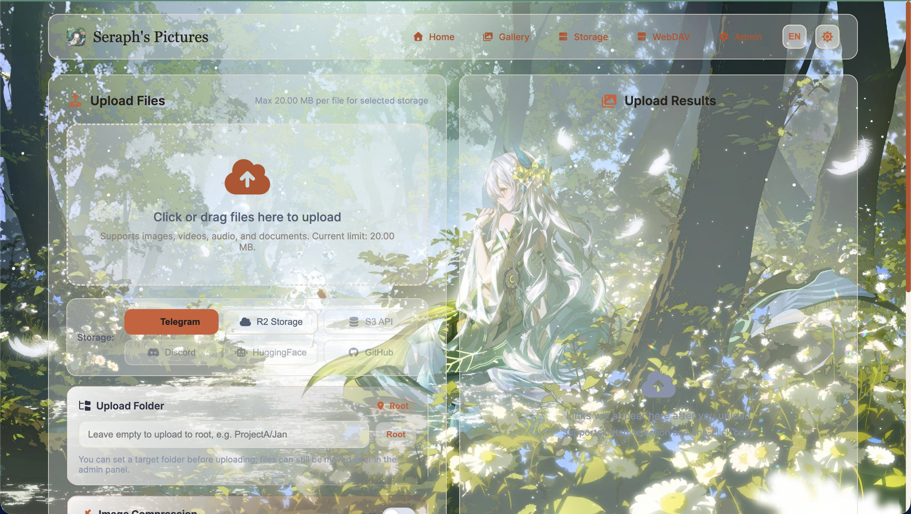
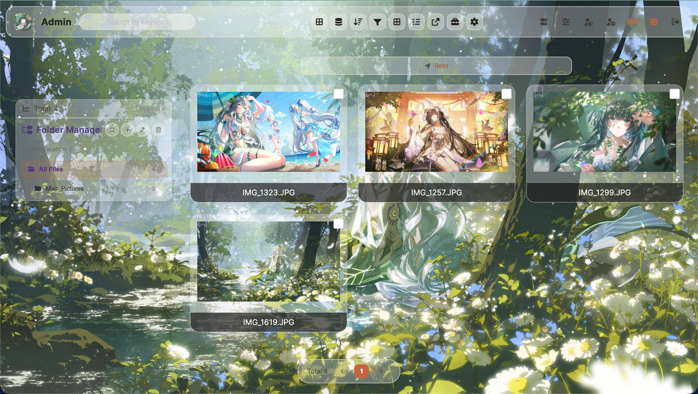
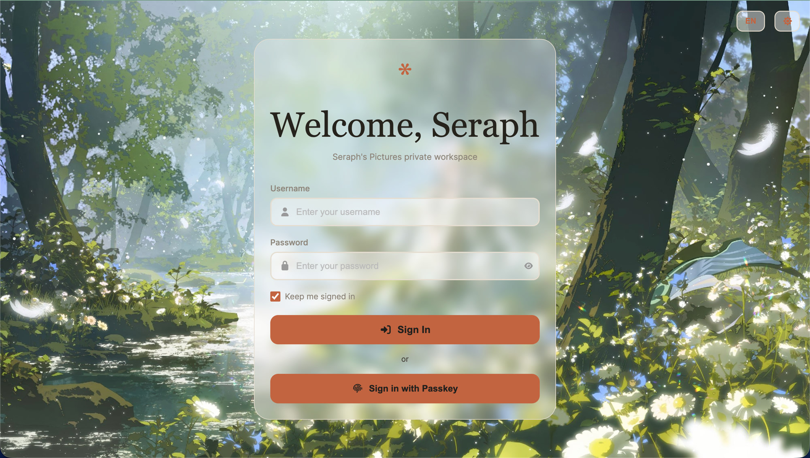
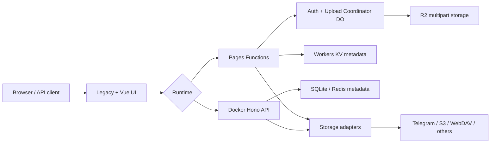

<div align="center">
  

# Seraph's Pictures

面向 Cloudflare 与 Docker 的私有媒体工作区，支持多存储、访客图床、文件管理和安全分享。

**中文** | [English](README-EN.md)

[](LICENSE)


</div>

## 安全警告

> [!WARNING]
> Fork 后不要直接部署仓库内的 Wrangler 配置。必须替换两个配置文件中的项目名、Worker 名、全部 KV ID、R2 桶名、Durable Object `script_name`、WebAuthn 域名/来源和迁移 audience；先部署 Coordinator，再部署 Pages。

> [!IMPORTANT]
> 生产环境必须启用认证并使用 Secrets。`AUTH_DISABLED=true` 仅允许本地运行；Coordinator、KV 或加密密钥异常时服务会明确失败，不会降级到旧凭据或明文配置。

## 功能与界面

- 上传图片、音视频和文档，支持 URL 上传、分片/多段上传及 SSRF 防护。
- Telegram、R2、S3、Discord、Hugging Face、WebDAV、GitHub 多存储适配。
- 密码、Passkey/WebAuthn、作用域 API Token、短链和私有签名分享。
- 目录树、筛选、批量移动/删除、重命名、可见性管理和在线预览。
- 开放访客图床时使用隔离的 Telegram Bot/频道、固定配额和内容真实性校验。
- Legacy 稳定界面：`/`、`/login.html`、`/admin.html`、`/gallery.html`、`/webdav.html`、`/storage-settings.html`。
- Vue 界面：`/app/`、`/app/drive`、`/app/storage`、`/app/status`；两种运行时均已实现其 Storage、Drive 和 Share API。

| 上传 | 图库 | 管理 | Passkey |
| :---: | :---: | :---: | :---: |
|  |  |  |  |

## 架构



Cloudflare 以 Durable Objects 协调认证与 R2 multipart 状态，以 KV 保存元数据；Docker 以 Hono、SQLite（可选 Redis 设置存储）和持久卷运行。界面保持一致，持久化与适配实现不同。

## 快速开始

| 目标 | 选择 | 最短路径 |
| --- | --- | --- |
| 全球边缘、无服务器 | Cloudflare Pages + Worker | 创建 KV/R2/DO，改配置，先部署 Worker 后部署 Pages |
| VPS、NAS、本地私有化 | Docker Compose | 生成 `.env`，修改密钥，构建并启动 |

```bash
npm ci
npm run frontend:build
npm run docker:init-env
docker compose up -d --build
npm run docker:doctor
```

Node.js 22+ 用于开发与 Docker 后端。不要把 `.env`、真实 Token、密码或加密密钥提交到仓库。

## Cloudflare 部署

1. 创建 Pages 项目、KV namespace、R2 bucket，以及承载两个 Durable Object 的 Worker。
2. 在 `wrangler.jsonc` 和 `workers/coordinator/wrangler.jsonc` 中替换所有仓库专用值：

| 占位符 | 必须替换的位置 |
| --- | --- |
| `<PAGES_PROJECT>` | Pages `name` |
| `<COORDINATOR_WORKER>` | Worker 顶层及 `env.production.name`、两个 DO `script_name` |
| `<KV_NAMESPACE_ID>` | 两文件中全部 KV ID，包括 `env.production` |
| `<R2_BUCKET>` | 两文件中全部桶名，包括 `env.production` |
| `<YOUR_DOMAIN>` | `WEBAUTHN_RP_ID` 与 HTTPS `WEBAUTHN_ORIGIN` |
| `<MIGRATION_AUDIENCE>` | 当前 KV audience；通常取你的 KV namespace ID |

3. 在 Pages 生产 Secrets 中配置 `BASIC_USER`、`BASIC_PASS`、`SESSION_SECRET`、`CONFIG_ENCRYPTION_KEY`、`FILE_SHARE_SECRET_CURRENT`；按需增加主存储凭据及访客专用 `TG_GUEST_BOT_TOKEN`、`TG_GUEST_CHAT_ID`。普通变量配置 WebAuthn RP/origin，绑定名保持 `img_url`、`R2_BUCKET`、`AUTH_COORDINATOR`、`UPLOAD_COORDINATOR`。
4. 保留已有 R2 生命周期规则，用“读取—追加—复查”添加 multipart 清理规则；禁止使用会整体替换规则集的操作：

```bash
npx wrangler r2 bucket lifecycle list <R2_BUCKET>
npx wrangler r2 bucket lifecycle add <R2_BUCKET> abort-incomplete-uploads multipart/ --abort-multipart-days 1
npx wrangler r2 bucket lifecycle list <R2_BUCKET>
npx wrangler deploy --config workers/coordinator/wrangler.jsonc --env production
npm run frontend:build
npx wrangler pages deploy frontend/dist --project-name <PAGES_PROJECT> --branch main
node scripts/probe-coordinator-binding.mjs --base-url https://<YOUR_DOMAIN>
```

部署顺序不可颠倒。生命周期规则仅终止 `multipart/` 前缀下一天未完成的上传，不删除完整对象；若已有全前缀默认规则或其他规则，必须原样保留。`npm run pages:deploy` 会读取已检入配置，Fork 未完成全部替换前不要运行。

## Docker 部署

```bash
npm run docker:init-env
docker compose up -d --build
npm run docker:doctor
docker compose logs api
```

启动前修改 `.env` 中所有示例密钥。默认 SQLite 数据和配置位于 `kvault_data` 持久卷；`SETTINGS_STORE=redis` 时使用外部 Redis，Compose 的本地 Redis 通过 profile 启动。反向代理必须提供 HTTPS，并令 `PUBLIC_BASE_URL`、WebAuthn RP/origin 与公开域名一致。完整说明见 [Docker 中文指南](README-DOCKER.md)。

## 存储与上传能力

| 后端 | Cloudflare | Docker | 硬上限 |
| --- | --- | --- | --- |
| R2 | direct / multipart | direct / chunked | 管理员配置，默认最高 100 MiB |
| S3、WebDAV | direct / streaming | direct / chunked | 管理员配置，默认最高 100 MiB |
| Telegram | direct | direct / chunked | Cloudflare/访客 20 MiB；Docker 管理员最高 50 MiB |
| Discord | direct | direct / chunked | 25 MiB |
| Hugging Face | direct | direct / chunked | 35 MiB |
| GitHub | direct | direct / chunked | 管理员配置，默认最高 100 MiB |

20 MiB 是 direct 阈值；只有 Cloudflare R2 使用 multipart。管理页保存的动态存储配置以 AES-GCM 加密：Cloudflare 写入 KV，Docker storage profiles 写入 SQLite；Redis 只可作为独立的通用设置存储。动态配置优先于环境变量，空白密钥字段表示保留旧值。R2 原生绑定仍由 Wrangler/Cloudflare 控制台管理。

### 多实例 Storage Profile

同一存储类型可创建多个命名 Profile，每个类型恰有一个 enabled default。管理员上传同时绑定 `storageMode` 与精确 `storageId`；禁用 Profile 不能接收新写入，但仍可读取、删除或迁移历史文件。环境变量只参与首次引导或显式迁移，运行时不会在 Profile 缺失、禁用或故障时回退到旧全局凭据。

Cloudflare R2 Profile 可选择 `binding`（填写 Wrangler 绑定名，例如 `R2_BUCKET`）或 `s3`（填写 endpoint、bucket、access key 和 secret）；Docker R2 使用 S3-compatible 凭据。Guest Channel 始终独立，访客不能列举或提交管理员 `storageId`。

升级既有 v1/Legacy/SQLite 数据前，先执行 dry-run，再用环境专用 driver 完成备份、freeze、stage、activate、live verify 和 marker。完整命令、回滚规则、错误含义及已验证哈希见 [多存储迁移演练](docs/2026-07-14_multi-storage-migration-rehearsal.md)。

## 安全模型

- **认证**：Pages 通过 `AuthCoordinator` 处理初始化、登录失败限制和会话状态；绑定或持久化失败时 fail closed。初始化后环境凭据不是运行时回退。
- **Passkey**：RP ID 是域名，origin 必须是对应 HTTPS 源站；更换域名后需重新注册凭据。
- **文件可见性**：Drive 来源默认 `private`；image-host、API 与 Legacy 来源默认 `public`，API 可显式请求 `private`。私有访问使用带过期时间的签名和可撤销 lease；访客文件默认 `public`。
- **访客上传**：必须同时配置独立的 `TG_GUEST_*`；缺失即拒绝，不回退管理员 Bot。仅接受签名、MIME 与扩展名一致的 AVIF/GIF/JPEG/PNG/WebP。每 IP 每日固定 10 次，保留期至少 1 天，配置上限 20 MiB，示例默认 5 MiB。
- **删除语义**：访客元数据到期会令项目链接失效，但不代表 Telegram 远端字节已删除；远端清理需按频道策略单独执行。

第二阶段未引入新的付费第三方依赖，但 Cloudflare Pages、Workers、KV、R2 和 Durable Objects 可能按用量计费；部署前检查服务商当前定价与额度。

## 配置参考

| 责任 | 变量或绑定 |
| --- | --- |
| 认证/加密 | `BASIC_USER`、`BASIC_PASS`、`SESSION_SECRET`、`CONFIG_ENCRYPTION_KEY` |
| 分享签名 | `FILE_SHARE_SECRET_CURRENT`、`FILE_SHARE_SECRET_PREVIOUS`、`FILE_SHARE_SECRET_PREVIOUS_VALID_UNTIL` |
| Passkey | `WEBAUTHN_RP_ID`、`WEBAUTHN_ORIGIN`、`WEBAUTHN_RP_NAME` |
| Pages 数据 | `img_url`、`R2_BUCKET`、`AUTH_COORDINATOR`、`UPLOAD_COORDINATOR` |
| Telegram | `TG_BOT_TOKEN`、`TG_CHAT_ID`、`TG_GUEST_BOT_TOKEN`、`TG_GUEST_CHAT_ID` |
| Docker 数据 | `DATA_DIR`、`DB_PATH`、`SETTINGS_STORE`、`SETTINGS_REDIS_URL`、`TRUST_PROXY` |
| 可选后端 | `R2_*`、`S3_*`、`WEBDAV_*`、`DISCORD_*`、`HF_*`、`GITHUB_*` |

Docker 基础模板见 [.env.example](.env.example)。开放 Docker 访客上传时还需加入 `TG_GUEST_*`、`GUEST_RETENTION_DAYS`，并仅在可信反向代理之后设置 `TRUST_PROXY=true`。变量仅负责首次引导时，管理员保存的加密动态配置会优先；错误会显式返回，不能假定自动回退。

## API 示例

UI 路由 `/app/storage`、`/app/drive` 不等于 API。以下操作均要求管理员认证：

| 范围 | 方法与路径 |
| --- | --- |
| Storage 查询/创建 | `GET /api/storage/list`、`POST /api/storage` |
| Storage 修改/测试 | `PUT/DELETE /api/storage/:id`、`POST /api/storage/default/:id`、`POST /api/storage/:id/test`、`POST /api/storage/test` |
| Drive 查询/目录 | `GET /api/drive/tree`、`GET /api/drive/explorer`、`POST /api/drive/folders`、`POST /api/drive/folders/move`、`DELETE /api/drive/folders` |
| Drive 文件/分享 | `POST /api/drive/files/move`、`POST /api/drive/files/rename`、`POST /api/drive/files/delete-batch`、`POST /api/share/sign` |

```bash
curl --fail-with-body https://<YOUR_DOMAIN>/api/auth/check
curl --fail-with-body https://<YOUR_DOMAIN>/api/status
curl --fail-with-body -u '<ADMIN_USER>:<ADMIN_PASSWORD>' -F file=@example.png https://<YOUR_DOMAIN>/upload
curl --fail-with-body -u '<ADMIN_USER>:<ADMIN_PASSWORD>' https://<YOUR_DOMAIN>/api/storage/list
curl --fail-with-body -u '<ADMIN_USER>:<ADMIN_PASSWORD>' https://<YOUR_DOMAIN>/api/drive/tree
curl --fail-with-body -u '<ADMIN_USER>:<ADMIN_PASSWORD>' --json '{"fileId":"<FILE_ID>"}' https://<YOUR_DOMAIN>/api/share/sign
```

脚本集成使用后台签发的 Bearer Token 调用 `/api/v1/*`；不要在 URL 中传 Token。受保护 API 未认证时应返回 401/403，而不是伪造空结果。

## 验证

```bash
npm run frontend:build
npm test -- --reporter dot
npm audit --omit=dev
npm run test:storage-e2e
npm run test:auth-e2e
npm run test:visual
```

清单中的版本范围表示支持声明，lockfile 表示当前精确解析版本，安全报告表示某次完成验证时使用的版本，三者不可互换。浏览器 E2E 需要 Playwright 浏览器和对应运行时；生产验证结果见 [第二阶段安全报告](docs/2026-07-13_security-phase-two-report.md)。

## 故障排查

| 现象 | 根因与处理 |
| --- | --- |
| `COORDINATOR_BINDING_*` / 登录 5xx | Worker 未先部署、`script_name` 不一致或 DO 迁移缺失；核对两份配置并运行 binding probe |
| `NO_ENC_KEY` | 设置 `CONFIG_ENCRYPTION_KEY` 或 `SESSION_SECRET`，不要保存明文凭据 |
| `GUEST_STORAGE_NOT_CONFIGURED` | 同时设置访客 Bot Token 与 Chat ID |
| multipart 残留 | 先 list 规则，再追加一日 abort 规则并复查；不要覆盖已有 lifecycle |
| Passkey origin/RP 错误 | RP 仅填域名，origin 填完整 HTTPS 源站，二者与浏览器地址一致 |
| Docker 启动拒绝 | 替换示例密码/密钥，检查持久卷权限并查看 `docker compose logs api` |
| `STORAGE_PROFILE_NOT_FOUND` / `STORAGE_NOT_WRITABLE` | 检查请求中的精确 `storageId`、类型和 enabled 状态；不要回退全局凭据 |
| `STORAGE_PROFILE_IN_USE` | Profile 仍被文件、分片任务或 lifecycle 引用；完成或 reconciliation 后再修改 |
| `MIGRATION_ACTIVATION_AMBIGUOUS` | 保持 Cloudflare freeze 与 Docker lock，读取 authority/ledger 取得明确证据后恢复 |

## 维护与许可

核心目录：`frontend/`（Vue 与 Legacy 构建）、`functions/`（Pages Functions）、`workers/coordinator/`（DO Worker）、`server/`（Docker API）、`shared/`（跨运行时契约）、`test/` 与 `e2e/`（验证）、`docs/`（部署与安全报告）。R2 专项说明见 [Cloudflare Pages + R2](docs/cloudflare-pages-r2.md)，Docker English guide 见 [README-DOCKER-EN.md](README-DOCKER-EN.md)。

提交变更时同步更新中英文文档，运行构建与相关测试，不提交生成物、真实凭据或账户专用配置。项目依据 [MIT License](LICENSE) 发布。
