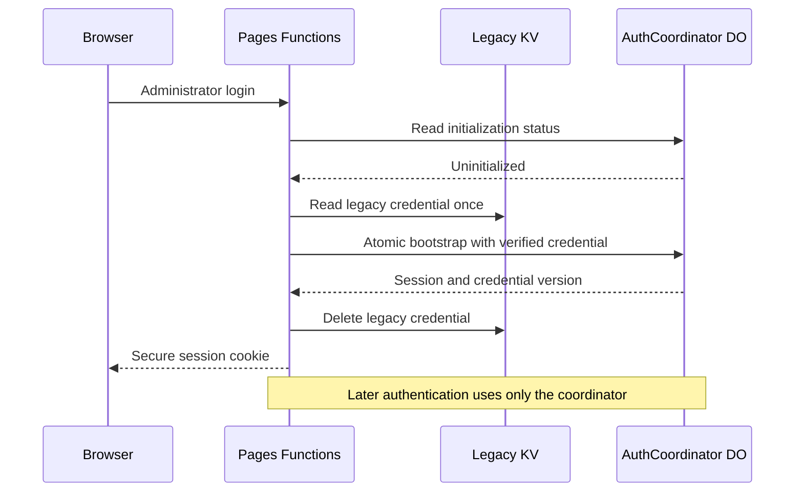

# Security phase two auth bridge report

> **Rollback warning:** production administrator state has been initialized in the Durable Object. Any Pages deployment older than commit `67eb377` is outside the supported security rollback boundary because it can reintroduce KV- or environment-based authentication behavior.

## Outcome

Phase 2A0 moved Cloudflare administrator authentication from eventually consistent KV state to the private, SQLite-backed `AuthCoordinator` Durable Object. Authentication now fails closed when the binding, coordinator, or response schema is unavailable, while the existing frontend markup and visual appearance remain unchanged.

Production deployment completed on 2026-07-13. The operator successfully signed in at `https://pictures.seraphzero.com`; the subsequent read-only KV audit confirmed that the legacy administrator credential was migrated and deleted.

## Production evidence

| Evidence | Verified value |
|---|---|
| Coordinator Worker | `k-vault-coordinator` |
| Coordinator version | `a3f3c882-6b04-4b17-adb2-211679a85049` |
| Candidate Pages deployment | `https://edc401d8.k-vault-2lv.pages.dev` |
| Production Pages deployment | `https://7264f5fb.k-vault-2lv.pages.dev` |
| Custom domain | `https://pictures.seraphzero.com` |
| Binding probe | `{"binding":"ok"}` on candidate, production, and custom domain |
| Pages artifact SHA-256 | `4f91a541f106bcc21e4d1e239d812aecf927ac60b8cd4b8c1d8a303a3019399e` |
| Post-login KV credential count | `0` |
| Supported rollback floor | Git commit `67eb377` |

The candidate artifact digest was recomputed after production login and remained identical, which rules out an unreviewed rebuild between candidate and production verification.

## Migration behavior

The migration does not fall back to `BASIC_USER` or `BASIC_PASS` when a legacy KV credential exists but cannot be read or verified. Coordinator errors, missing bindings, malformed envelopes, and state failures produce an explicit `503` response.

## Recovery evidence

Before deployment, production KV was exported to an encrypted backup outside the repository:

- Backup: `/Users/zhuzhishang/Documents/Seraph-Pictures-security-backups/2026-07-13-pre-2a0-kv.json`
- Manifest: adjacent manifest file with SHA-256 verification
- Ciphertext SHA-256: `91b62d8bfec6c9be1cbde6d058edb60315040b079459c1ecf2eab01bfdcc7df6`
- Encryption key storage: macOS Keychain service `com.seraph-pictures.security-backup`, account `Seraph-Pictures`
- Pre-deployment inventory: 12 KV keys, including 1 legacy credential and 1 guest configuration record
- Post-login inventory: 11 KV keys, with 0 legacy credential records

Backup creation included encrypted write, decrypt/read-back verification, pagination coverage, and a manifest checksum. No credential value was printed or committed.

## Verification performed

- 144 Mocha tests passed under the required 60-second backend timeout.
- Real local authentication E2E passed for bootstrap, normal login, credential rotation, old-session rejection, logout, missing binding, and coordinator outage.
- Coordinator Wrangler dry-run and Pages Functions compilation passed.
- Twenty desktop/mobile visual route checks passed against the immutable baseline.
- `git diff --check` passed.
- Independent review findings concerning response-envelope validation, migration fail-closed behavior, cookie security, challenge ownership, and production bypass were remediated before deployment.
- Production login was confirmed by the operator, and the legacy KV credential deletion was independently observed afterward.

## Security properties established

- The coordinator has `workers_dev = false` and no public route.
- Bootstrap, credential versioning, sessions, WebAuthn challenges, and counters use strongly consistent Durable Object state.
- Private coordinator responses are validated with operation-specific schemas.
- Credential changes invalidate older sessions immediately through credential version checks.
- Production cannot enable the local-only authentication bypass.
- Secure cookies are relaxed only for the explicitly identified local runtime.
- Binding or coordinator failure remains visible and cannot silently downgrade to guest or environment authentication.

