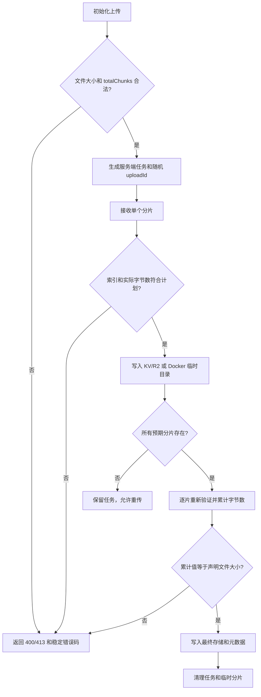

# Seraph Pictures 第一阶段安全升级报告

## 结果摘要

本次升级修复了分片上传元数据可伪造、分片越界写入、Docker 默认无认证、登录缺少失败限速以及 Vue 构建产物持续积累等问题。

> **部署变更：** Docker 现在默认启用认证。生产环境必须修改 `.env` 中的 `BASIC_PASS`，并配置有效的 `CONFIG_ENCRYPTION_KEY` 与 `SESSION_SECRET`。只有显式设置 `AUTH_DISABLED=true` 才会关闭认证。

## 已完成修复

| 范围 | 原问题 | 修复结果 |
|---|---|---|
| 分片计划 | 客户端可提交与文件大小不一致的 `totalChunks` | 服务端根据文件大小和分片大小验证唯一合法计划 |
| 单片上传 | 未限制索引范围和实际字节数 | 严格验证索引、普通分片和末片大小 |
| Docker 合并 | 同步读取全部分片并执行 `Buffer.concat` | 异步逐片验证并写入合并文件，最终只读取一次 |
| 任务标识 | Docker 使用时间戳和 `Math.random()` | 改用 `crypto.randomUUID()` |
| Docker 认证 | `.env.example` 默认关闭认证 | 默认启用认证，生产环境拒绝空值和示例凭据 |
| 登录保护 | Docker 密码登录无失败限制 | 每 IP 五次失败、十五分钟窗口、返回 `Retry-After` |
| 客户端 IP | 优先信任可伪造的 `X-Forwarded-For` | 优先使用代理覆盖的 `CF-Connecting-IP` 和 `X-Real-IP` |
| 构建产物 | 根 `app/` 采用合并复制，保留历史哈希 | 改为精确目录同步，删除 20 个旧资源 |

## 分片验证流程



## 关键实现位置

- 分片规则：`server/lib/services/chunk-policy.js`
- Docker 分片持久化：`server/lib/services/chunk-service.js`
- Cloudflare 分片规则：`functions/utils/chunk-policy.js`
- Cloudflare 入口：`functions/api/chunked-upload/`
- 生产配置验证：`server/lib/config.js`
- 登录限速：`server/lib/services/login-rate-limit-service.js`
- 客户端 IP 解析：`server/lib/utils/client-ip.js`
- 构建同步：`frontend/scripts/sync-directory.mjs`

## 错误语义

新增或稳定使用以下错误码：

- `INVALID_FILE_SIZE`
- `INVALID_TOTAL_CHUNKS`
- `CHUNK_PLAN_MISMATCH`
- `INVALID_CHUNK_INDEX`
- `INVALID_CHUNK_SIZE`
- `INCOMPLETE_UPLOAD`
- `UPLOAD_SIZE_MISMATCH`
- `INSECURE_PRODUCTION_CONFIG`
- `LOGIN_RATE_LIMITED`

分片或配置输入错误不会再统一变成无信息量的 HTTP 500/502。登录限速返回 HTTP 429，并附带 `Retry-After`。

## 部署操作

创建或更新 Docker 环境文件：

```bash
npm run docker:init-env
```

确认以下配置不为空且不是示例值：

```env
AUTH_DISABLED=false
BASIC_USER=admin
BASIC_PASS=<强密码>
CONFIG_ENCRYPTION_KEY=<长随机密钥>
SESSION_SECRET=<另一条长随机密钥>
```

然后启动：

```bash
docker compose up -d --build
```

若生产配置不安全，服务会以 `INSECURE_PRODUCTION_CONFIG` 明确失败，不会自动退回开放模式。

## 验证证据

全量测试使用 60 秒硬超时运行：

```bash
python3 -c "import subprocess; subprocess.run(['npm','test'], check=True, timeout=60)"
```

结果：`102 passing`，无失败。

生产构建：

```bash
npm run build
```

结果：Vite 构建成功，根目录 `app/assets` 与 `frontend/dist/app/assets` 文件集合完全一致。`git diff --check` 通过，功能分支工作区保持干净。

## 当前保留边界

Cloudflare 完成分片上传时仍需构造最终 `Blob/File`，尚未实现 R2/S3 端到端 multipart upload。本阶段已阻止越界和声明大小绕过；真正的云端流式上传属于后续独立升级范围。
