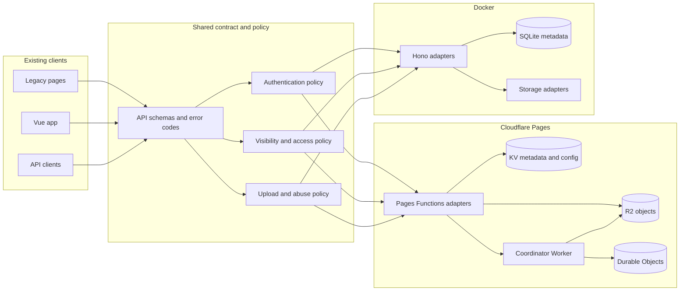
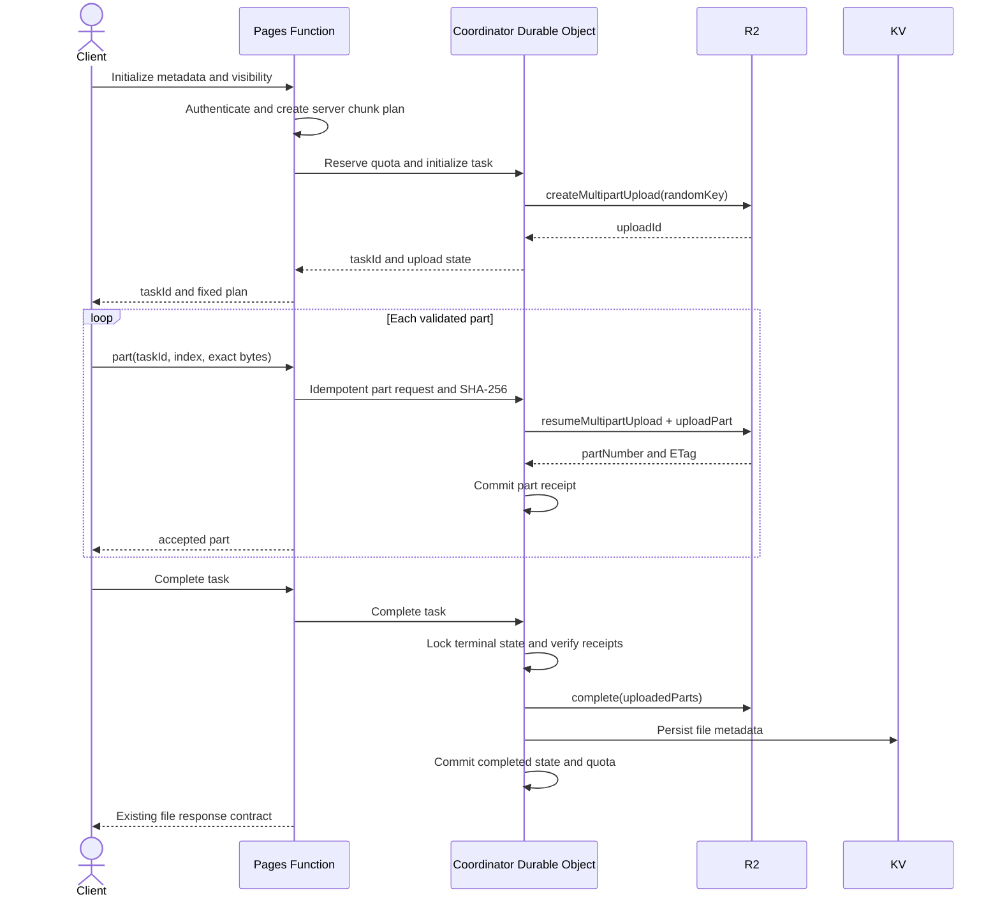

# Security upgrade phase two design

> **Status:** Approved for planning on 2026-07-13. This phase fixes the remaining P0/P1/P2 audit findings without changing the visual interface, layout, wording, or navigation of the existing Legacy and Vue frontends.

## Goal

Make Cloudflare Pages and Docker enforce the same explicit authentication, file visibility, upload, status, and deployment security rules while preserving the project's public image-hosting and immediate guest-upload use cases.

## Scope and invariants

This phase covers:

- fail-closed administrator authentication and runtime storage configuration;
- explicit public/private file metadata and access decisions;
- immediate public guest uploads with abuse controls;
- minimal anonymous status responses;
- native R2 multipart uploads and bounded non-R2 uploads;
- Cloudflare implementations for the existing Storage/Drive API contract;
- dependency remediation and deployment gates;
- self-hosted browser dependencies, CSP, security headers, E2E, contract, and visual regression checks.

The following invariants are mandatory:

- Existing HTML structure, CSS, colors, fonts, spacing, controls, copy, and routes remain visually unchanged.
- Existing file URLs continue to resolve after metadata migration.
- No authentication, configuration, upload, or storage failure returns a fake success or silently weakens security.
- Platform adapters do not decide authorization policy.
- Secrets, password material, signatures, and complete sensitive configuration never enter logs or API responses.

## Architecture



Runtime-neutral policy modules contain only deterministic rules and injected dependencies. Cloudflare adapters own KV calls, while a small coordinator Worker serializes authentication state, guest quotas, share counters, and R2 multipart state in Durable Objects. Docker adapters use SQLite transactions and storage services. Contract tests execute the same cases against both adapters.

The Cloudflare design targets the free plan: it requires only Pages, KV, R2, one Worker, and SQLite-backed Durable Objects. It does not require D1, Queues, Analytics Engine, Turnstile, or a paid Rate Limiting binding. Coordinator records contain only small metadata and are deleted by alarms after expiry; the default guest limits keep normal personal-image-host usage within published free allowances. Exceeding provider allowances remains an explicit operational condition, not a silent degradation path.

## Authentication and configuration state

Administrator credentials use three explicit states:

| State | Condition | Behavior |
|---|---|---|
| Bootstrap | The singleton auth Durable Object transaction finds no state row | Verify configured `BASIC_USER/BASIC_PASS` once |
| Initialized | The Durable Object contains one valid `initialized` row | The hashed row is the sole credential source |
| Unavailable | The coordinator is unavailable or the row is invalid | Return `AUTH_STATE_UNAVAILABLE` with HTTP 503 |

The first successful bootstrap login runs in the singleton auth Durable Object: its SQLite transaction rechecks absence, derives/writes one versioned `initialized` row, and only then creates a session. Concurrent bootstrap attempts serialize; only the winning credentials initialize state. Later credential changes transactionally replace that row and increment `credVersion`. Every administrator session check asks the auth object for the current version, so old sessions stop immediately rather than waiting for KV propagation. The auth object is never deleted by runtime cleanup; recovery requires an explicit authenticated backup restore or operator reset command, and runtime fallback is forbidden.

Runtime storage configuration remains encrypted in KV, while the coordinator stores its authoritative initialization/version state:

- before initialization, environment secrets are accepted as bootstrap values;
- after initialization, encrypted KV values matching the coordinator version are authoritative;
- KV read, schema, or decryption failures return explicit 503 errors;
- blank secret fields preserve existing encrypted values;
- R2/KV bindings and root encryption/session secrets remain dashboard-managed infrastructure.

## File visibility and access

Every file record gains immutable-origin metadata and explicit visibility:

```json
{
  "visibility": "public",
  "uploadSource": "guest",
  "createdAt": 1783958400000,
  "expiresAt": 1786550400000
}
```

`visibility` is `public` or `private`. `uploadSource` records `guest`, `image-host`, `drive`, or `api`.

- Guest uploads are always public and immediately return a high-entropy URL.
- The image-host upload flow explicitly requests public visibility.
- Drive/private-workspace uploads default to private.
- API uploads must pass an allowed visibility; omitted visibility uses the endpoint's documented default.
- Public file bytes are anonymous-readable, but anonymous listing, search, mutation, and sensitive metadata access are forbidden.
- Private file bytes require an administrator session or a valid expiring signed share link.
- Authorization failures do not reveal whether a private identifier exists.

Visibility changes use an administrator-only API and increment `accessVersion`; guest files cannot be changed to private until ownership is transferred by an administrator. A change to `accessVersion` invalidates existing private share links. Existing Legacy share slugs for public files remain aliases and do not claim private-access guarantees.

New private share links use `/s/{shareId}?exp={unixMs}&sig={hmac}`. HMAC-SHA-256 covers `shareId`, file ID, expiry, and `accessVersion`. `FILE_SHARE_SECRET_CURRENT` is dashboard-managed; an optional previous key is accepted only during a bounded rotation window. TTL defaults to 24 hours, is at least 60 seconds, and is at most 30 days. The stored share record supports explicit revocation, optional password verification, and an optional maximum download count. Replay is allowed until expiry/revocation/count exhaustion; Cloudflare updates the counter atomically in the coordinator and Docker uses a SQLite transaction.

Existing records are backed up and migrated once to explicit `public` visibility so current image-host links remain valid. After the migration marker is committed, a missing/invalid visibility value is a data error and is never interpreted as public.

## Guest upload policy

Guest uploads remain immediate but pass all server-side controls before storage begins:

- guest uploads must be enabled in KV policy;
- maximum size is 20 MiB;
- MIME type, extension, declared size, and actual bytes must agree;
- an exact daily quota and burst limit apply;
- retention metadata is mandatory when retention is enabled;
- guest objects use the dedicated guest storage channel;
- management actions remain administrator-only;
- errors use stable codes and never consume quota as a successful upload.

The default daily limit remains 10 completed uploads and the default burst limit is 5 initializations per 60 seconds. Cloudflare derives the client address only from `CF-Connecting-IP`; Docker uses its trusted-proxy parser. Persistence uses `HMAC-SHA-256(SESSION_SECRET, normalizedAddress)` rather than the raw address.

Cloudflare sends the digest to one Durable Object, which atomically reserves a daily slot at initialization. Completion converts the reservation to consumed; cancellation or terminal failure releases it; an alarm releases abandoned reservations after one hour. Docker performs the same transitions in a SQLite transaction. Burst and daily limits are configurable, but a missing coordinator binding returns `GUEST_QUOTA_UNAVAILABLE` (503) instead of allowing an uncounted upload.

## Status API

Anonymous `GET /api/status` returns only a stable liveness document:

```json
{
  "status": "ok"
}
```

It performs no storage probes and returns no provider names, endpoints, binding state, latency, or error details. Authenticated administrators may request detailed status. Detailed probes use injected timeouts, bounded concurrency, and rate limiting; errors are normalized before returning to the browser.

## R2 multipart upload



Non-final R2 parts are uniform and at least 5 MiB. Each request includes SHA-256; the coordinator hashes the received bytes, rejects a mismatch, uploads those verified bytes to R2, and retains the digest with the returned ETag. The Workers multipart API is not treated as an independent checksum validator. The coordinator derives a clearly labeled multipart root digest from ordered part digests, not a whole-file SHA-256. Multipart ETags are never treated as whole-file hashes.

The coordinator owns the task state machine: `created -> uploading -> completing -> completed` or `created/uploading -> aborting -> aborted`. `(taskId, partNumber, partDigest)` is the idempotency key. Repeating it returns the stored receipt; reusing a part number with different bytes returns 409. Completion atomically enters `completing`; duplicate completion observes the stored terminal result. Cancellation cannot overtake `completing`. A metadata-write failure leaves a recoverable `object-complete/publish-pending` state, retried by request or alarm, and does not expose the file early. Terminal failures call `abort()`, and the bucket lifecycle aborts incomplete multipart uploads after one day.

Non-R2 backends declare capabilities and maximum safe sizes. Initialization rejects unsupported size/mode combinations before accepting bytes. Backends that cannot safely stream completion do not reconstruct unbounded files in memory.

## Storage and Drive contract

Cloudflare implements the existing Vue `/api/storage/*` and `/api/drive/*` contract over current encrypted KV configuration and file metadata. It does not create a third configuration source.

Docker and Cloudflare share:

- request/response schemas;
- authentication and visibility decisions;
- pagination semantics;
- stable error codes;
- capability reporting.

An operation that the selected backend genuinely cannot perform returns `UNSUPPORTED_STORAGE_OPERATION`; it never returns a simulated success. The existing `/storage-settings` page remains operational and unchanged.

## Dependency and delivery security

Dependency remediation is explicit and non-forcing:

- upgrade direct `hono` and `wrangler` dependencies to non-vulnerable compatible releases;
- resolve vulnerable `miniflare`, `undici`, `ws`, `esbuild`, and `form-data` transitives through supported parent upgrades or narrow overrides;
- verify root, server, and frontend lockfiles independently;
- reject high/critical advisories in CI;
- pin third-party GitHub Actions to reviewed commit SHAs.

The production pipeline is ordered:

```text
install -> audit -> lint/static checks -> unit/contract tests
        -> Playwright/visual checks -> production build
        -> coordinator deploy/migration -> binding probe -> Pages deploy
```

The deploy job depends on every gate and cannot start when a required check fails or is skipped unexpectedly. The coordinator Worker sets `workers_dev = false`, has no public route, and exports its Durable Object namespace only through the Pages binding with an explicit `script_name`. Its handlers accept only the narrow internal operation contract; no HTTP endpoint exposes credential, quota, share, or upload state publicly.

## Browser dependency and CSP policy

Legacy browser dependencies are copied from locked packages into versioned `/vendor/` build output. Production pages no longer execute scripts from jsDelivr or another CDN.

- Remove HTML event-handler attributes while preserving equivalent event listeners; implementation markup may change, but rendered content and behavior may not.
- Generate CSP hashes for remaining immutable inline bootstrap scripts.
- Use `script-src 'self'` plus generated hashes; do not use `unsafe-eval`.
- Allow images, previews, workers, and Office embedding only through documented directives required by current features.
- Emit CSP, `X-Content-Type-Options`, `Referrer-Policy`, `Permissions-Policy`, and frame protection through Pages `_headers` and Docker middleware.
- CI rejects unapproved external script/style URLs and missing header output.

## Error handling and observability

Boundary failures expose a stable code, appropriate HTTP status, and request ID. Internal logs record the code, request ID, runtime, and failing stage. They exclude passwords, tokens, cookies, signatures, full storage configuration, and raw persistent client addresses.

Security-sensitive examples include:

- `AUTH_STATE_UNAVAILABLE` (503)
- `STORAGE_CONFIG_UNAVAILABLE` (503)
- `FILE_VISIBILITY_INVALID` (500)
- `FILE_ACCESS_DENIED` (404 for anonymous/private lookup)
- `UPLOAD_MODE_UNSUPPORTED` (400)
- `MULTIPART_STATE_INVALID` (409)
- `UNSUPPORTED_STORAGE_OPERATION` (422)

## Verification

Automated verification includes:

- fault-injection tests for KV reads, corrupt records, credential versioning, and encryption failures;
- access-matrix tests for public/private/admin/signed/anonymous requests;
- guest type, size, quota, retention, and rate-limit tests;
- R2 multipart create, part, retry, complete, abort, and expiry tests;
- shared Cloudflare/Docker API contract tests;
- dependency audit, lint, CSP, external-resource, function/file-size, and build checks;
- Playwright flows for login, guest upload, public link, private denial, signed sharing, admin, Storage, and Drive;
- deterministic screenshot comparisons for the current key pages;
- backend unit tests under a hard 60-second timeout.

## Rollout and rollback

Delivery is split into independently verifiable releases:

1. **2A0:** deploy the private coordinator and a minimal Pages authentication bridge; this becomes the secure rollback floor before auth initialization.
2. **2A1:** configuration fail-closed, visibility migration, guest policy, and minimal status.
3. **2B:** R2 multipart, bounded alternate backends, Cloudflare Storage/Drive, and cross-runtime contracts.
4. **2C:** dependency remediation and mandatory deployment gates.
5. **2D:** self-hosted browser dependencies, CSP/headers, E2E, visual regression, and code governance.

Before 2A0, capture deterministic screenshots, routes, visible copy, and DOM-facing behavior as the immutable visual baseline, then export the affected KV credential, configuration, and metadata keys without logging their values. Deploy the empty coordinator schema, verify its private binding, and deploy the 2A0 Pages bridge before allowing bootstrap initialization. If initialization has not occurred, the pre-2A0 release remains a valid rollback; after the first successful initialization, 2A0 is the permanent rollback floor and older code must not be redeployed. Later rollbacks deploy Pages down to 2A0 first and retain the compatible coordinator. Each migration is idempotent and versioned; a failed migration or binding probe stops deployment. Existing R2 objects and URLs are not rewritten, and no rollback may reactivate environment-password fallback.

## Non-goals

- Redesigning or replacing either frontend.
- Migrating all Docker modules to ESM or all Legacy pages to Vue.
- Replacing every storage provider with R2.
- Providing anonymous file enumeration.
- Adding silent compatibility paths or simulated platform capabilities.
