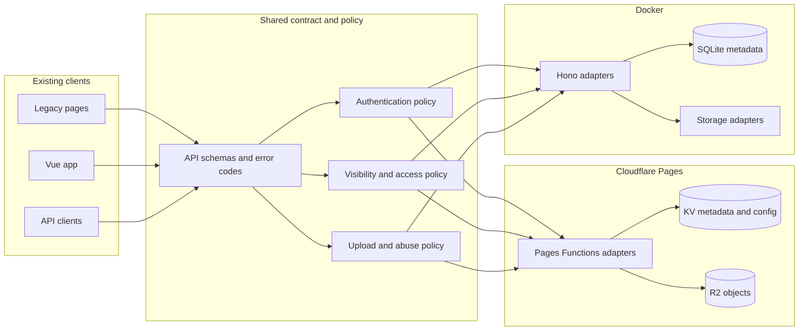
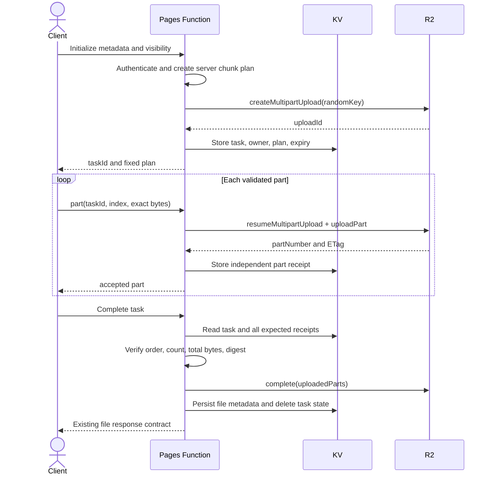

# Security upgrade phase two design

> **Status:** Approved for planning on 2026-07-13. This phase fixes the remaining P0/P1/P2 audit findings without changing the visual interface, layout, wording, or navigation of the existing Legacy and Vue frontends.

## Goal

Make Cloudflare Pages and Docker enforce the same explicit authentication, file visibility, upload, status, and deployment security rules while preserving the project's public image-hosting and immediate guest-upload use cases.

## Scope and invariants

This phase covers:

- fail-closed administrator authentication and runtime storage configuration;
- explicit public/private file metadata and access decisions;
- immediate public guest uploads with abuse controls;
- minimal anonymous status responses;
- native R2 multipart uploads and bounded non-R2 uploads;
- Cloudflare implementations for the existing Storage/Drive API contract;
- dependency remediation and deployment gates;
- self-hosted browser dependencies, CSP, security headers, E2E, contract, and visual regression checks.

The following invariants are mandatory:

- Existing HTML structure, CSS, colors, fonts, spacing, controls, copy, and routes remain visually unchanged.
- Existing file URLs continue to resolve after metadata migration.
- No authentication, configuration, upload, or storage failure returns a fake success or silently weakens security.
- Platform adapters do not decide authorization policy.
- Secrets, password material, signatures, and complete sensitive configuration never enter logs or API responses.

## Architecture



Runtime-neutral policy modules contain only deterministic rules and injected dependencies. Cloudflare adapters own KV/R2 calls; Docker adapters own SQLite and storage-service calls. Contract tests execute the same cases against both adapters.

## Authentication and configuration state

Administrator credentials use three explicit states:

| State | Condition | Behavior |
|---|---|---|
| Bootstrap | KV read succeeds and no initialization marker exists | Allow configured `BASIC_USER/BASIC_PASS` for first login only |
| Initialized | Marker and valid hashed credential record exist | KV record is the sole credential source |
| Unavailable | KV read fails, record is corrupt, or marker/record disagree | Return `AUTH_STATE_UNAVAILABLE` with HTTP 503 |

Changing credentials writes the credential record and initialization marker, increments `credVersion`, issues a new current session, and invalidates older sessions. A transient KV failure must never reactivate an environment password.

Runtime storage configuration follows the same distinction:

- before initialization, environment secrets are accepted as bootstrap values;
- after initialization, encrypted KV values are authoritative;
- KV read, schema, or decryption failures return explicit 503 errors;
- blank secret fields preserve existing encrypted values;
- R2/KV bindings and root encryption/session secrets remain dashboard-managed infrastructure.

## File visibility and access

Every file record gains immutable-origin metadata and explicit visibility:

```json
{
  "visibility": "public",
  "uploadSource": "guest",
  "createdAt": 1783958400000,
  "expiresAt": 1786550400000
}
```

`visibility` is `public` or `private`. `uploadSource` records `guest`, `image-host`, `drive`, or `api`.

- Guest uploads are always public and immediately return a high-entropy URL.
- The image-host upload flow explicitly requests public visibility.
- Drive/private-workspace uploads default to private.
- API uploads must pass an allowed visibility; omitted visibility uses the endpoint's documented default.
- Public file bytes are anonymous-readable, but anonymous listing, search, mutation, and sensitive metadata access are forbidden.
- Private file bytes require an administrator session or a valid expiring signed share link.
- Authorization failures do not reveal whether a private identifier exists.

Existing records are backed up and migrated once to explicit `public` visibility so current image-host links remain valid. After the migration marker is committed, a missing/invalid visibility value is a data error and is never interpreted as public.

## Guest upload policy

Guest uploads remain immediate but pass all server-side controls before storage begins:

- guest uploads must be enabled in KV policy;
- maximum size is 20 MiB;
- MIME type, extension, declared size, and actual bytes must agree;
- per-IP daily quota and request rate limit apply;
- retention metadata is mandatory when retention is enabled;
- guest objects use the dedicated guest storage channel;
- management actions remain administrator-only;
- errors use stable codes and never consume quota as a successful upload.

IP-derived abuse keys store a keyed digest rather than the raw address where persistence is required.

## Status API

Anonymous `GET /api/status` returns only a stable liveness document:

```json
{
  "status": "ok"
}
```

It performs no storage probes and returns no provider names, endpoints, binding state, latency, or error details. Authenticated administrators may request detailed status. Detailed probes use injected timeouts, bounded concurrency, and rate limiting; errors are normalized before returning to the browser.

## R2 multipart upload



Non-final R2 parts are uniform and at least 5 MiB. Part receipts are independent KV keys so parallel uploads cannot overwrite a shared array. Cancellation and terminal failures call `abort()`. The bucket lifecycle aborts incomplete multipart uploads after one day as a final cleanup boundary. Multipart ETags are never treated as whole-file hashes; a separate SHA-256 is stored.

Non-R2 backends declare capabilities and maximum safe sizes. Initialization rejects unsupported size/mode combinations before accepting bytes. Backends that cannot safely stream completion do not reconstruct unbounded files in memory.

## Storage and Drive contract

Cloudflare implements the existing Vue `/api/storage/*` and `/api/drive/*` contract over current encrypted KV configuration and file metadata. It does not create a third configuration source.

Docker and Cloudflare share:

- request/response schemas;
- authentication and visibility decisions;
- pagination semantics;
- stable error codes;
- capability reporting.

An operation that the selected backend genuinely cannot perform returns `UNSUPPORTED_STORAGE_OPERATION`; it never returns a simulated success. The existing `/storage-settings` page remains operational and unchanged.

## Dependency and delivery security

Dependency remediation is explicit and non-forcing:

- upgrade direct `hono` and `wrangler` dependencies to non-vulnerable compatible releases;
- resolve vulnerable `miniflare`, `undici`, `ws`, `esbuild`, and `form-data` transitives through supported parent upgrades or narrow overrides;
- verify root, server, and frontend lockfiles independently;
- reject high/critical advisories in CI;
- pin third-party GitHub Actions to reviewed commit SHAs.

The production pipeline is ordered:

```text
install -> audit -> lint/static checks -> unit/contract tests
        -> Playwright/visual checks -> production build -> Pages deploy
```

The deploy job depends on every gate and cannot start when a required check fails or is skipped unexpectedly.

## Browser dependency and CSP policy

Legacy browser dependencies are copied from locked packages into versioned `/vendor/` build output. Production pages no longer execute scripts from jsDelivr or another CDN.

- Remove HTML event-handler attributes while preserving equivalent event listeners.
- Generate CSP hashes for remaining immutable inline bootstrap scripts.
- Use `script-src 'self'` plus generated hashes; do not use `unsafe-eval`.
- Allow images, previews, workers, and Office embedding only through documented directives required by current features.
- Emit CSP, `X-Content-Type-Options`, `Referrer-Policy`, `Permissions-Policy`, and frame protection through Pages `_headers` and Docker middleware.
- CI rejects unapproved external script/style URLs and missing header output.

## Error handling and observability

Boundary failures expose a stable code, appropriate HTTP status, and request ID. Internal logs record the code, request ID, runtime, and failing stage. They exclude passwords, tokens, cookies, signatures, full storage configuration, and raw persistent client addresses.

Security-sensitive examples include:

- `AUTH_STATE_UNAVAILABLE` (503)
- `STORAGE_CONFIG_UNAVAILABLE` (503)
- `FILE_VISIBILITY_INVALID` (500)
- `FILE_ACCESS_DENIED` (404 for anonymous/private lookup)
- `UPLOAD_MODE_UNSUPPORTED` (400)
- `MULTIPART_STATE_INVALID` (409)
- `UNSUPPORTED_STORAGE_OPERATION` (422)

## Verification

Automated verification includes:

- fault-injection tests for KV reads, corrupt records, credential versioning, and encryption failures;
- access-matrix tests for public/private/admin/signed/anonymous requests;
- guest type, size, quota, retention, and rate-limit tests;
- R2 multipart create, part, retry, complete, abort, and expiry tests;
- shared Cloudflare/Docker API contract tests;
- dependency audit, lint, CSP, external-resource, function/file-size, and build checks;
- Playwright flows for login, guest upload, public link, private denial, signed sharing, admin, Storage, and Drive;
- deterministic screenshot comparisons for the current key pages;
- backend unit tests under a hard 60-second timeout.

## Rollout and rollback

Delivery is split into independently verifiable releases:

1. **2A:** authentication/config fail-closed, visibility migration, guest policy, and minimal status.
2. **2B:** R2 multipart, bounded alternate backends, Cloudflare Storage/Drive, and cross-runtime contracts.
3. **2C:** dependency remediation and mandatory deployment gates.
4. **2D:** self-hosted browser dependencies, CSP/headers, E2E, visual regression, and code governance.

Before 2A, export the affected KV credential, configuration, and metadata keys without logging their values. Each migration is idempotent and records a schema version. A failed migration stops deployment. Existing R2 objects and URLs are not rewritten. Rollback restores the previous code and metadata backup; it does not re-enable an environment-password fallback after credential initialization.

## Non-goals

- Redesigning or replacing either frontend.
- Migrating all Docker modules to ESM or all Legacy pages to Vue.
- Replacing every storage provider with R2.
- Providing anonymous file enumeration.
- Adding silent compatibility paths or simulated platform capabilities.
